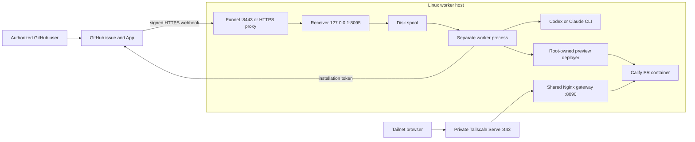
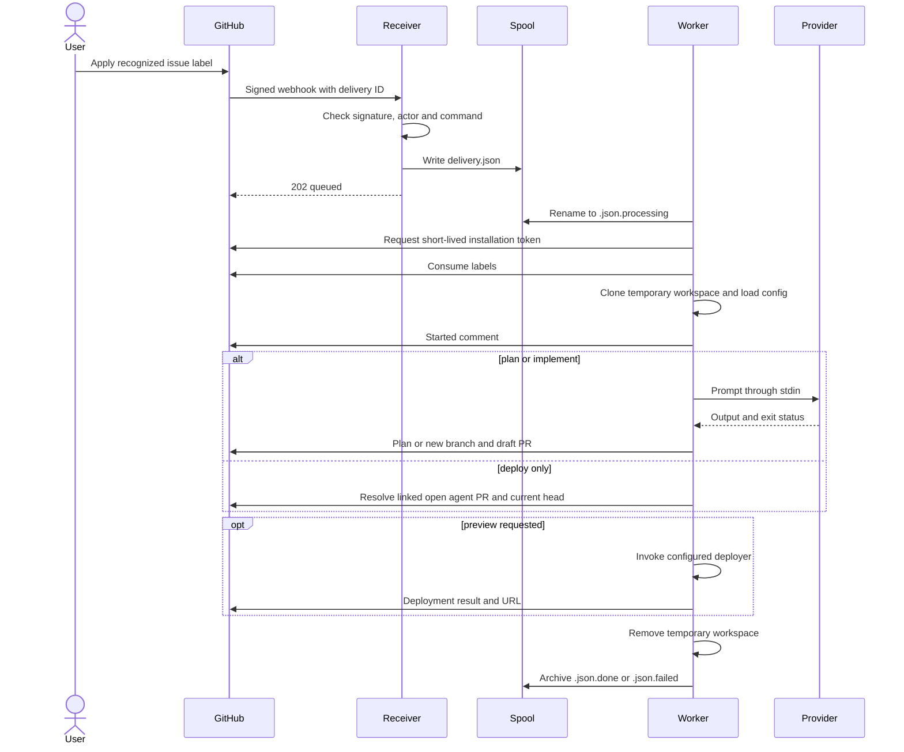

# Architecture

## Two supported execution paths

| Path | Trigger and process | Validation and publication |
| --- | --- | --- |
| GitHub App worker | Signed webhook → disk spool → separate systemd worker → provider CLI | Worker posts plans or commits a new branch and creates a draft PR. Optional preview deployment. No automatic repository test gate in this worker yet. |
| GitHub Actions template | Issue event → authorized self-hosted runner job → CLI | Template has explicit validation, protected-file checks, patch artifacts, and draft-PR publication. Deploy-label semantics are not implemented by this template. |
| Local CLI | Operator runs `plan` or `implement` | CLI invokes the provider. The outer operator/workflow owns validation and publication. |

Choose one event-processing path per repository. Enabling both for the same issue labels can launch duplicate runs. This wiki focuses on the GitHub App worker.

## Component map

Editable PlantUML sources are on [Diagrams](Diagrams.md).

## Who owns what?

| Component | Responsibility | Source or location |
| --- | --- | --- |
| GitHub App | Identity, permissions, selected repositories, webhook subscriptions | GitHub App settings |
| Receiver | Verify HMAC, authorize sender and command, write a task | `src/webhook.ts` |
| Spool | Persist task envelopes across process restarts | `/var/lib/lrai-agent/webhook-spool` |
| Worker | Claim work, obtain App installation token, manage workspace, post results | `src/worker.ts` |
| Provider adapter | Build bounded CLI arguments and pass the task through stdin | `src/providers.ts` |
| Config and prompts | Defaults, repository models/prompts, task text | `src/config.ts`, `src/task.ts`, `prompts/` |
| Attachment loader | Download supported GitHub attachments with size/host limits | `src/attachments.ts` |
| Preview deployer | Enforce the configured target, build the requested commit, check health | `deploy/jetson/lrai-agent-preview-deploy.sh` |
| Gateway | Route private application requests to containers | Separate `jetson-app-gateway` repository |
| Operator | Service installation, OAuth login, keys, updates, review, recovery | VM administration |

The local program name, provider identity, GitHub App bot identity, and Git commit author are different things. LRAI Agent is the orchestrator; Codex/Claude supplies the model execution; the App's installation token authorizes API actions.

## One task from issue to result

The worker scans for queued `.json` files, handles them sequentially, then waits two seconds before scanning again. The current file order is directory order, not a promised FIFO queue. `202 queued` only acknowledges intake.

## Boundaries actually enforced

The receiver verifies the raw-body signature and uses `LRAI_ALLOWED_SENDERS`. Issue events additionally require the sender to be the issue author. Comment commands require an allowed sender. The current receiver has no additional repository/installation-ID allowlist; selected App installations and the sender check are the available ingress controls.

Codex gets a read-only sandbox for planning and workspace-write for implementation. Claude gets Read/Glob/Grep for plans, adding Edit/Write for implementation. The adapter spawns argument arrays without a shell.

These are application/provider boundaries, not a separate VM per task. Provider processes share the service user and inherit the process environment. The Jetson worker can read host homes, has writable provider state, and has a narrow sudo path to a root deployer. See [current limitations](Troubleshooting-and-Limitations.md) before treating this as a general multi-tenant execution service.

Source: [worker](https://github.com/lrai-engineering/lrai-agent/blob/main/src/worker.ts), [receiver](https://github.com/lrai-engineering/lrai-agent/blob/main/src/webhook.ts), [adapters](https://github.com/lrai-engineering/lrai-agent/blob/main/src/providers.ts), [Actions template](https://github.com/lrai-engineering/lrai-agent/blob/main/templates/github/agent-issue.yml).
