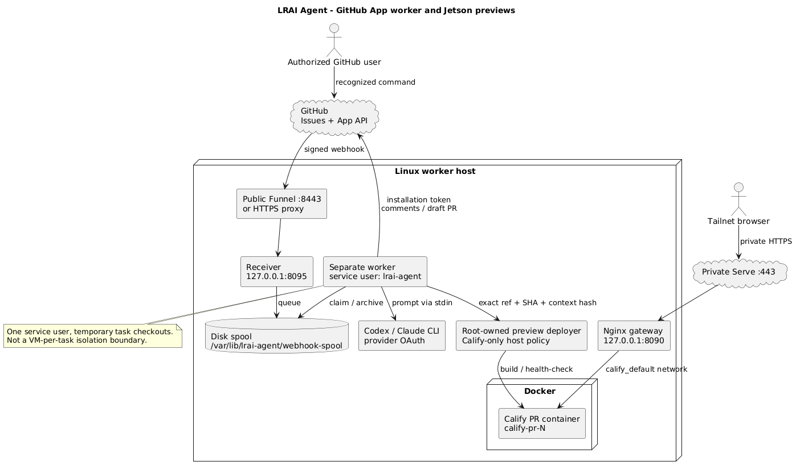
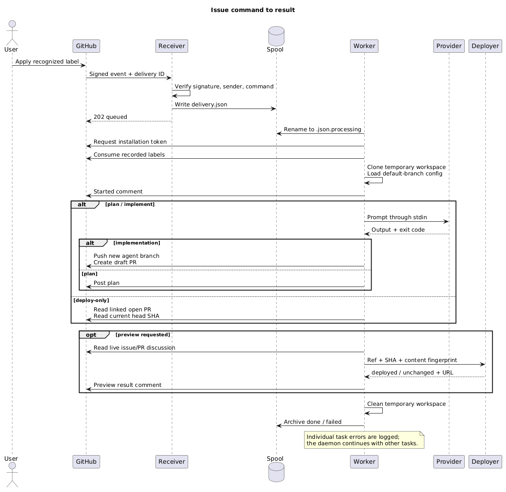
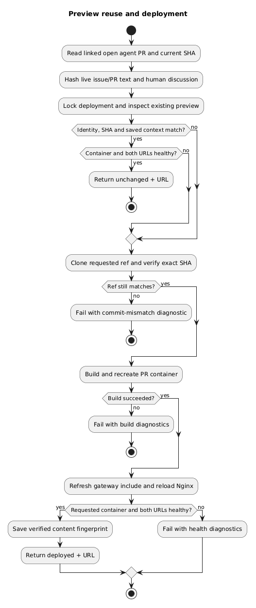

# Diagrams

The diagrams describe the GitHub App worker and the Jetson preview integration at the documented source baseline.

## Architecture



[Editable PlantUML source](assets/architecture.puml)

[Scalable SVG](assets/architecture.svg)

## Task lifecycle



[Editable PlantUML source](assets/task-lifecycle.puml)

[Scalable SVG](assets/task-lifecycle.svg)

## Preview decision



[Editable PlantUML source](assets/preview-decision.puml)

[Scalable SVG](assets/preview-decision.svg)

## Editing and rendering

Edit `docs/wiki/assets/*.puml` in the source repository. Rendered PNGs and SVGs are committed alongside them, so readers do not need a browser extension or public rendering service. Architecture/deployment pages also include native Mermaid versions.

With a local PlantUML installation, render the files using its SVG option. With Docker, this pinned renderer is the one used for the initial wiki:

```bash
for diagram_format in svg png; do
  docker run --rm --network none --user "$(id -u):$(id -g)" \
    -v "$PWD/docs/wiki/assets:/data" \
    ghcr.io/plantuml/plantuml@sha256:d08610df482510844382caa4e016ba2bf7e3231f630f02ee12f250f3416c62b1 \
    "-t$diagram_format" /data/architecture.puml /data/task-lifecycle.puml /data/preview-decision.puml
done
```

Run from the LRAI Agent checkout after the image is available locally. Inspect the resulting SVGs and run `node scripts/check-wiki.mjs`. Update both the native Mermaid diagrams and the PlantUML sources if the architecture changes.

See the [PlantUML command-line reference](https://plantuml.com/command-line) and [GitHub diagram rendering documentation](https://docs.github.com/en/get-started/writing-on-github/working-with-advanced-formatting/creating-diagrams).
