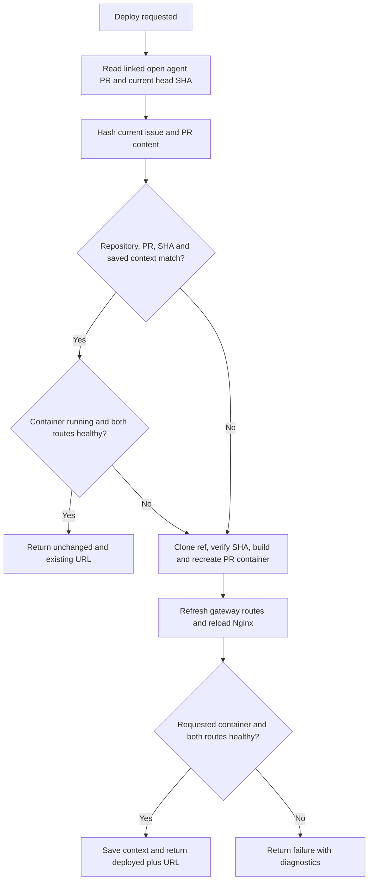

# Preview deployments

## Scope of the supplied deployer

The shipped script accepts only repository `lukasijus/calify` and app `calify`. It also depends on the existing Jetson gateway checkout at `/home/luke/jetson-app-gateway`, its Compose service, the external Docker network `calify_default`, and Calify's `compose.yaml` service/build contract.

A different VM or application needs an explicitly implemented deployment adapter. Setting `preview.app: another-app` does not create that support.

| Target | Route |
| --- | --- |
| Canonical Calify main deployment | `/calify`, maintained by Calify/gateway infrastructure |
| PR number N | `/calify-pr-N`, isolated Compose project and container |
| Example PR 3 URL | `https://jetson.tail68fd31.ts.net/calify-pr-3` |

The private request path is browser → Tailscale Serve → `127.0.0.1:8090` → shared Nginx gateway → the PR container on `calify_default`. The webhook path on public port 8443 is separate.

## Install the existing Jetson integration

First confirm the gateway and Calify contracts above. Build/check the agent checkout. Then review and run:

```bash
sudo bash deploy/jetson/install-preview-deployer.sh
```

This is an integration installer, not fresh-host bootstrap. It assumes the service user, provider runtime/login, protected App configuration, and webhook unit already exist. It installs the packed worker, preview script, sudoers rule, worker unit, and gateway boot unit. It restarts the webhook, worker, and `lrai-jetson-preview.service`; schedule it as a broader host update.

The narrow `update-preview-worker.sh` script is only for the worker/deployer fix described in [Updating and operating](Updating-and-Operating.md).

## Deployment decision



The content fingerprint includes issue/PR titles and bodies, human comments, inline review comments, and review bodies. Bot discussion and label timestamps are excluded. New commits are detected independently by the exact head SHA. No fingerprint is stored for a legacy preview, so its next successful deployment establishes the baseline.

The script serializes deployment with a file lock. An unchanged healthy preview returns before cloning or running Compose. A changed commit, changed content, or unhealthy preview takes the deployment path. Health checks cover both the local gateway and certificate-verified private HTTPS URL.

## Worker/deployer contract

The worker invokes the configured command without a shell and passes:

```text
--repository owner/repo
--pull-request N
--ref branch-name
--sha 40-character-commit-sha
--app app-name
--context-sha 64-character-sha256
```

It supplies a short-lived GitHub installation token in the child environment as `LRAI_GITHUB_TOKEN`. The sudoers rule preserves that variable for the root-owned script. Never add it to issue text or print it in diagnostics.

Success must be exit code zero plus exactly one JSON result on stdout:

```json
{"status":"unchanged","url":"https://jetson.tail68fd31.ts.net/calify-pr-3"}
```

A fresh deployment uses `"status":"deployed"`. Diagnostics go to stderr. A zero exit without a valid status/HTTPS URL is rejected.

## Expected issue comments

Unchanged preview:

```text
Nothing changed in PR #3 or its issue; no redeploy needed.

URL: https://jetson.tail68fd31.ts.net/calify-pr-3
Commit: <full SHA>
```

Changed preview:

```text
Preview deployed for PR #3.

URL: https://jetson.tail68fd31.ts.net/calify-pr-3
Commit: <full SHA>
```

## State and operational details

| State | Location |
| --- | --- |
| PR identity/commit | Docker labels `com.lrai-agent.preview.*` |
| Verified content fingerprint | `/var/lib/lrai-agent/previews/apps/calify/calify-pr-N.context-sha` |
| Per-PR Nginx routes | `/var/lib/lrai-agent/previews/gateway/routes/` |
| Combined gateway include | `/var/lib/lrai-agent/previews/gateway/previews.conf` |
| Deployment lock | `/var/lib/lrai-agent/previews/.deploy.lock` |

The combined Nginx include is bind-mounted. The deployer preserves its inode and reloads Nginx after route changes so recreated containers are resolved correctly.

There is currently no automatic PR-close teardown or image-retention policy. Container separation is per PR, but the source checkout retained under `apps/calify/current` is shared by the most recent deployment; it is not a per-PR history.

Source: [preview deployer](https://github.com/lrai-engineering/lrai-agent/blob/main/deploy/jetson/lrai-agent-preview-deploy.sh).
